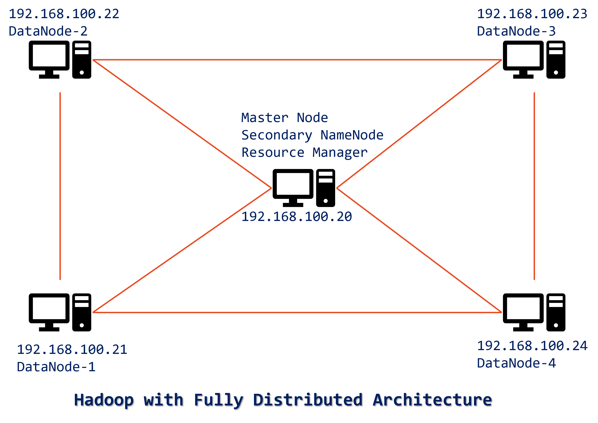
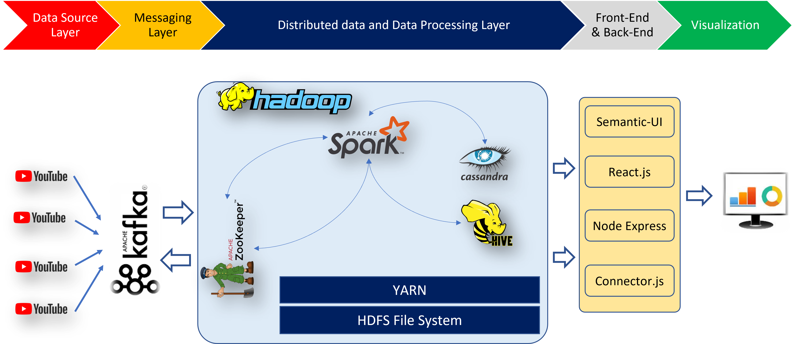

# Kafka-PySpark-Streaming-Analytics-YouTube





Project Steps
==============

## Windows setup
1. Zookepper
`bin\windows\zookeeper-server-start.bat config\zookeeper.properties`

2. Kafka Server
`bin\windows\kafka-server-start.bat config\server.properties`

3. Kafka Create Topic
`bin\windows\kafka-topics.bat --create --partitions 2 --replication-factor 1 --topic youtube-search-data --bootstrap-server localhost:9092`

4. Install offset Explorer
	`i. File -> Add New Connection -> properties tab`

	`ii. Cluster Name (Your Choice)`

	`iii. Zookeeper Host: localhost`

	`iv. Zookeeper Port: 2181`

	`v. Goto Advanced -> tab -> Bootstrap Server: "localhost:9092"`

5. Setp pyspark on Win
	##### STEP-I: JAVA
			-> Check Java is installed and set to environment variables
			-> JAVA_HOME = C:\Program Files\Java\jdk1.8.0_321
			-> PATH=%PATH%;C:\Program Files\Java\jdk1.8.0_321\bin
	##### STEP-II: SPARK
			-> Download spark
			-> https://spark.apache.org/downloads.html
			-> Using 7zip, extract and place in c:\spark\ dir
			-> SPARK_HOME  = C:\spark\spark-3.0.0-bin-hadoop2.7
			-> PATH=%PATH%;C:\spark\spark-3.0.0-bin-hadoop2.7\bin
			
	##### STEP-III: HADOOP
			-> HADOOP_HOME = c:\hadoop
			-> PATH=%PATH%;C:\hadoop\bin
			
	##### STEP-IV: Winutils.exe and hadoop.dll
			-> https://github.com/steveloughran/winutils/tree/master/hadoop-2.7.1/bin
			-> Place winutils.exe and hadoop.dll into 
				C:\spark\spark-3.0.0-bin-hadoop2.7\bin
				C:\hadoop\bin
				
	##### STEP-V: PySpark configuration
			-> open cmd
				> pyspark
			-> Goto browser and type:- http://localhost:4041
			
	##### STEP-VI: History Server
			-> Go to C:\spark\spark-3.0.0-bin-hadoop2.7\conf
			-> copy spark-default.conf.template to spark-default.conf
			-> open spark-default.conf in notepad++
			-> Remove # at line 23 (spark.eventLog.enabled) and 24(spark.eventLog.dir)
			-> Set event log DIR as file:///c:/sparkLogs
			-> Add new line at the end of the file as
				spark.history.fs.logDirectory     file:///c:/sparkLogs
			-> open cmd and Run the below command
				C:\spark\spark-3.0.0-bin-hadoop2.7\bin\spark-class.cmd org.apache.spark.deploy.history.HistoryServer
			-> Go to the browser and type:- http://localhost:18080/

6. Install python packages

	`-> findspark`

	`-> kafka-python`

	`-> pyspark=3.0.2`

	`-> cassandra-driver`

8. Download jars related to Kafka
   
	`-> spark-sql-kafka-0-10`

	`-> spark-streaming-kafka-0-10`

8. Cassandra
   
	`-> create key space "youtubedata"`

	`-> CREATE KEYSPACE youtubedata WITH replication = {'class':'SimpleStrategy', 'replication_factor' : 3};`

## Linux/Ubuntu setup 
`TO DO`

# How to cite

BibTeX format for LaTeX source:

```
@INPROCEEDINGS{10021052,
  author={Reddy, Jagan Mohan and Attuluri, Abhishek and Kolli, Abhinay and Sakib, Nazmus and Shahriar, Hossain and Cuzzocrea, Alfredo},
  booktitle={2022 IEEE International Conference on Big Data (Big Data)}, 
  title={A Crowd Source System for YouTube Big Data Analytics: Unpacking Values from Data Sprawl}, 
  year={2022},
  volume={},
  number={},
  pages={5451-5457},
  doi={10.1109/BigData55660.2022.10021052}}
  ```
